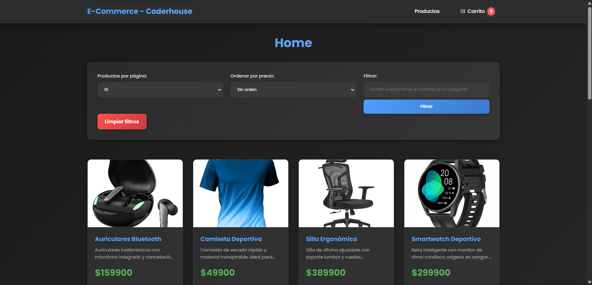
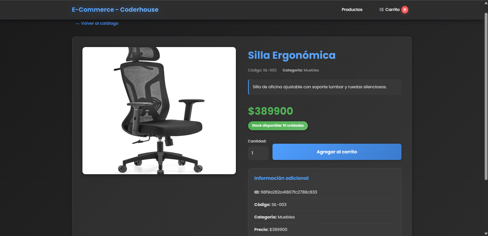
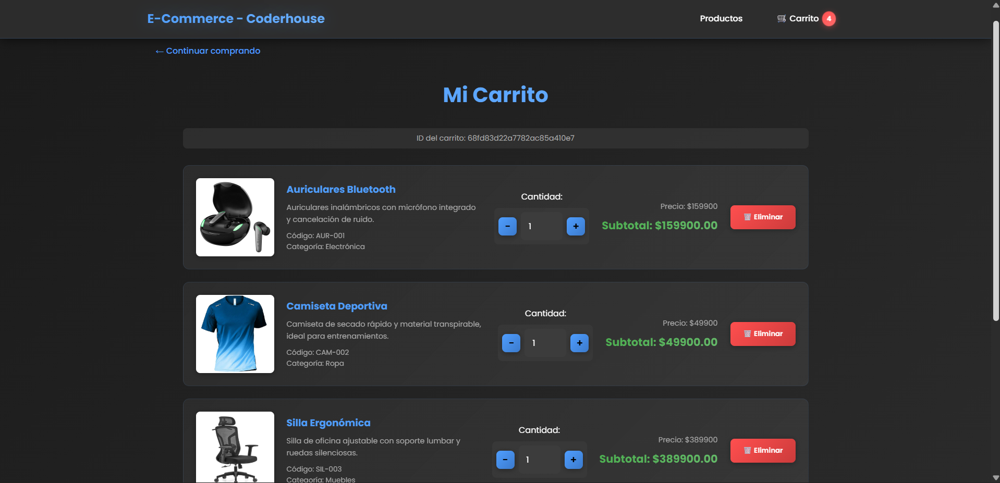

# 

## Coderhouse - Comision 76625

### Tecnologías utilizadas

---

## Entrega #1 (12-9-2025)

### Descripción General

Desarrollar un servidor que contenga los endpoints y servicios necesarios para gestionar los productos y carritos de compra para tu API.

## Requisitos de la primera entrega

### Desarollo del Servidor

El servidor debe estar basado en Node.js y Express, y debe escuchar en el puerto 8080. Se deben disponer dos grupos de rutas: /products y /carts. Estos endpoints estarán implementados con el router de Express, con las siguientes especificaciones:

### Rutas para Manejo de Productos (/api/products/)

- `GET /`: Debe listar todos los productos de la base de datos.
- `GET /:pid`: Debe traer solo el producto con el id proporcionado.
- `POST /`: Debe agregar un nuevo producto con los siguientes campos:
  - id: Number/String (No se manda desde el body, se autogenera para asegurar que nunca se repitan los ids).
  - title (string)
  - description (string)
  - code (string)
  - price (number)
  - status (boolean)
  - stock (number)
  - category (string)
  - thumbnail (array de Strings, rutas donde están almacenadas las imágenes del producto)
- `PUT /:pid`: Debe actualizar un producto por los campos enviados desde el body. No se debe actualizar ni eliminar el idal momento de hacer la actualización.
- `PUT /:pid`: Debe eliminar el producto con el pid indicado.

### Rutas para Manejo de Carritos (/api/carts/)

- `POST /`: Debe crear un nuevo carrito con la siguiente estructura:

  - id: Number/String (Autogenerado para asegurar que nunca se dupliquen los ids).
  - products: Array que contendrá objetos que representen cada producto.

- `GET /:cid`: Debe listar los productos que pertenecen al carrito con el `cid` proporcionado.
- `POST /:cid/product/:pid`: Debe agregar el producto al arreglo products del carrito seleccionado, utilizando el siguiente formato:
  - product: Solo debe contener el ID del producto.
  - quantity: Debe contener el número de ejemplares de dicho producto (se agregará de uno en uno).

Si un producto ya existente intenta agregarse, se debe incrementar el campo `quantity` de dicho producto.

## Persistencia de la información

- La persistencia se implementará utilizando el sistema de archivos, donde los archivos products.json y carts.json respaldarán la información.
- Se debe utilizar el ProductManager desarrollado en el desafío anterior y crear un CartManager para gestionar el almacenamiento de estos archivos JSON.
- Nota: No es necesario realizar ninguna implementación visual, todo el flujo se puede realizar por Postman o por el cliente de tu preferencia.

---

## Entrega #2 (7-10-2025)

### Websockets

## Consigna

Configurar nuestro proyecto para que trabaje con Handlebars y websocket.

### Aspectos a incluir

- Configurar el servidor para integrar el motor de plantillas Handlebars e instalar un servidor de socket.io al mismo.

- Crear una vista `home.handlebars` la cual contenga una lista de todos los productos agregados hasta el momento.

- Además, crear una vista `realTimeProducts.handlebars`, la cual vivirá en el endpoint `/realtimeproducts` en nuestro views router, ésta contendrá la misma lista de productos, sin embargo, ésta trabajará con websockets.

- Al trabajar con websockets, cada vez que creemos un producto nuevo, o bien cada vez que eliminemos un producto, se debe actualizar automáticamente en dicha vista la lista.

### Sugerencias

- Ya que la conexión entre una consulta HTTP y websocket no está contemplada dentro de la clase. Se recomienda que, para la creación y eliminación de un producto, Se cree un formulario simple en la vista realTimeProducts.handlebars. Para que el contenido se envíe desde websockets y no HTTP. Sin embargo, esta no es la mejor solución, leer el siguiente punto.

- Si se desea hacer la conexión de socket emits con HTTP, deberás buscar la forma de utilizar el servidor io de Sockets dentro de la petición POST. ¿Cómo utilizarás un emit dentro del POST?

---

<table>
  <tr>
    <th><code>home.handlebars</code></th>
    <th><code>realTimeProducts.handlebars</code></th>
  </tr>
  <tr>
    <td></td>
    <td></td>
  </tr>
</table>

---

## Entrega Final (23-10-2025)

### Objetivos generales

- Contarás con Mongo como sistema de persistencia principal

- Tendrás definidos todos los endpoints para poder trabajar con productos y carritos.

### Objetivos específicos

- Profesionalizar las consultas de productos con filtros, paginación y ordenamientos

- Profesionalizar la gestión de carrito para implementar los últimos conceptos vistos.

### Se debe entregar

Con base en nuestra implementación actual de productos, modificar el método GET / para que cumpla con los siguientes puntos:

- Deberá poder recibir por query params un limit (opcional), una page (opcional), un sort (opcional) y un query (opcional)

  - limit permitirá devolver sólo el número de elementos solicitados al momento de la petición, en caso de no recibir limit, éste será de 10.

- page permitirá devolver la página que queremos buscar, en caso de no recibir page, ésta será de 1

- query, el tipo de elemento que quiero buscar (es decir, qué filtro aplicar), en caso de no recibir query, realizar la búsqueda general

- sort: asc/desc, para realizar ordenamiento ascendente o descendente por precio, en caso de no recibir sort, no realizar ningún ordenamiento

- query, el tipo de elemento que quiero buscar (es decir, qué filtro aplicar), en caso de no recibir query, realizar la búsqueda general

- sort: asc/desc, para realizar ordenamiento ascendente o descendente por precio, en caso de no recibir sort, no realizar ningún ordenamiento

### Se debe entregar

El método GET deberá devolver un objeto con el siguiente formato:

<code>{

status:success/error

payload: Resultado de los productos solicitados

totalPages: Total de páginas

prevPage: Página anterior

nextPage: Página siguiente

page: Página actual

hasPrevPage: Indicador para saber si la página previa existe

hasNextPage: Indicador para saber si la página siguiente existe.

prevLink: Link directo a la página previa (null si hasPrevPage=false)

nextLink: Link directo a la página siguiente (null si hasNextPage=false)

}</code>

Se deberá poder buscar productos por categoría o por disponibilidad, y se deberá poder realizar un ordenamiento de estos productos de manera ascendente o descendente por precio.

### Se debera entregar

- Además, agregar al router de carts los siguientes endpoints:

  - DELETE api/carts/:cid/products/:pid deberá eliminar del carrito el producto seleccionado.

  - PUT api/carts/:cid deberá actualizar todos los productos del carrito con un arreglo de productos.

  - PUT api/carts/:cid/products/:pid deberá poder actualizar SÓLO la cantidad de ejemplares del producto por cualquier cantidad pasada desde req.body

  - DELETE api/carts/:cid deberá eliminar todos los productos del carrito

Esta vez, para el modelo de Carts, en su propiedad products, el id de cada producto generado dentro del array tiene que hacer referencia al modelo de Products. Modificar la ruta /:cid para que al traer todos los productos, los traiga completos mediante un “populate”. De esta manera almacenamos sólo el Id, pero al solicitarlo podemos desglosar los productos asociados.

### Se debera entregar

- Modificar la vista index.handlebars en el router de views ‘/products’, creada en la pre-entrega anterior, para visualizar todos los productos con su respectiva paginación.

- Además, cada producto mostrado puede resolverse de dos formas:
  - Llevar a una nueva vista con el producto seleccionado con su descripción completa, detalles de precio, categoría, etc. Además de un botón para agregar al carrito.

Sugerencia de la ruta: “/products/:pid”.

- Contar con el botón de “agregar al carrito” directamente, sin necesidad de abrir una página adicional con los detalles del producto.

- Además, agregar una vista en ‘/carts/:cid (cartId) para visualizar un carrito específico, donde se deberán listar SOLO los productos que pertenezcan a dicho carrito.

---

<table align="center">
  <tr>
    <th><code>home.handlebars</code></th>
    <th><code>productDetail.handlebars</code></th>
  </tr>
  <tr>
    <td align="center">
      
    </td>
    <td align="center">
      
    </td>
  </tr>
</table>

  <code>cart.handlebars</code> 
  

---
